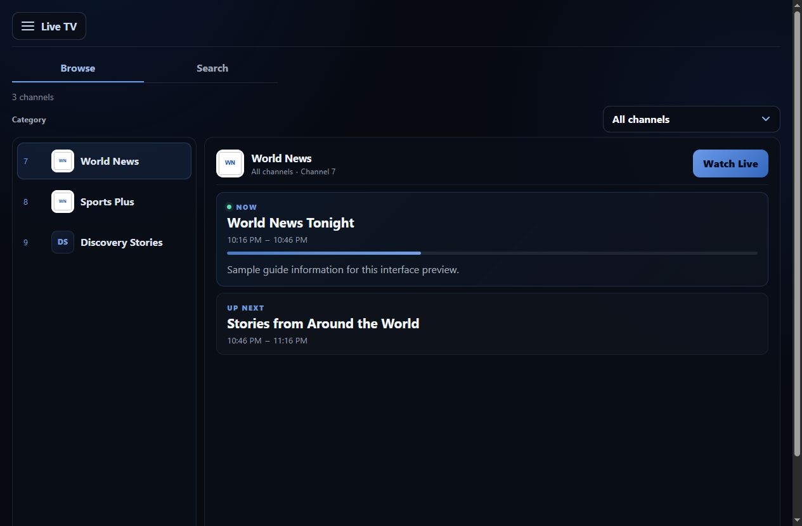

# Watch Now

*A web player for Dispatcharr.*

Live TV, Movies, and Series in a lightweight interface for phones, tablets, and
desktops. Give viewers a place to watch without giving them Dispatcharr's admin
interface.

Watch Now is independent and open source. It is not affiliated with or endorsed
by Dispatcharr or VideoLAN. Bring your own Dispatcharr installation and XC viewer
account; no channels, subscriptions, or media are supplied.

The screenshot uses sample channels and guide data, not a real viewer's lineup.

**[Installation](docs/installation.md)** · [HTTPS hosting](docs/public-hosting.md) ·
[Support](SUPPORT.md) · [Release notes](RELEASE_NOTES.md)

## What it does

- Browse live channels and search current/upcoming shows when a viewer-specific guide is available.
- Browse Movies and Series, watch supported formats in the browser, or use VLC and downloads.
- Follow the viewer permissions supplied by Dispatcharr, with sessions kept in memory.
- Run one non-root container with a Go backend and compiled React interface: no database or transcoder.

## Privacy and telemetry

Watch Now does **not** include usage analytics, tracking pixels, advertising SDKs,
or any other application telemetry, and it does not phone home to the maintainer.
Your Watch Now instance communicates with the Dispatcharr endpoint you configure
and with services you deliberately place around it, such as your reverse proxy.

GitHub and container registries may keep their own normal service access logs and
aggregate download/traffic statistics. Those platform-level statistics are
separate from Watch Now and are not collected by the application.

## Releases

**Watch Now 1.0.0** is published. Check
[GitHub Releases](https://github.com/JermZone/watch-now/releases) for release notes,
source assets, checksums, the verified image digest, and versioned install bundles.
Install from `ghcr.io/jermzone/watch-now:1.0.0` or the stable `latest` tag.

Starting with future releases, the release workflow publishes a
`watch-now-<version>-install.zip` containing the Compose file, `.env.example`,
installation guide, README, and license. GitHub's release asset download count can
be used as a privacy-friendly adoption signal without adding telemetry to Watch Now.

The earlier `ghcr.io/jermzone/dispatcharr-now:1.0.2` beta remains a separate,
unchanged historical image. The clean Watch Now repository intentionally does not
import the former development repository's Git history. Relevant source-handover
identifiers and validation evidence are preserved in
[source provenance](PROVENANCE.md) and [release readiness](docs/release-readiness.md).
See [migration](docs/migration.md) before changing an existing installation.

**Known issue:** Watch has been reported to become unresponsive after signing out
and back in. Investigation is deferred; the cause and a reliable workaround are
not verified. [Issue #11](https://github.com/JermZone/watch-now/issues/11) remains
open. The current issue preserves the original report context and retained test
evidence. Version 1.0.0 does not fix that report.

## Getting started

You need Docker with Compose v2 or Portainer, a Dispatcharr HTTP/XC endpoint
reachable from the container, and an existing **XC viewer** username/password.
The viewer's API & XC credentials may differ from the administration login.

Dispatcharr **0.31.0** is the earlier tested baseline, not a version whitelist.
Linux **AMD64** is the initial image target; ARM64 is not yet validated. Browser
playback depends on codecs. VLC is optional and must be installed separately.

Follow the [installation guide](docs/installation.md) for isolated source testing
and the Docker/Portainer route after image publication. Keep Dispatcharr's
administration interface private; use [HTTPS hosting](docs/public-hosting.md)
before exposing Watch Now to the internet.

## Playback and compatibility

| Area | Recorded development checks / limits |
| --- | --- |
| iPhone/iPad | Navigation and VLC handoff checked during development; one VLC movie session exceeded 45 minutes. |
| Desktop | Firefox navigation and browser playback checked; downloaded playlists opened in desktop VLC. |
| Browser video | Depends on container, video/audio codecs, and browser. Unsupported formats may need VLC. There is no transcoding. |
| Media badges | Use metadata supplied by XC. Missing resolution is not guessed or measured by probing video. |
| Live show search | Requires a usable viewer-specific XMLTV guide; channel search remains available without it. |
| Permissions | A restricted viewer lineup was manually checked; automated tests cover viewer separation and revoked access. |

These playback records are from development, not a repeat on the new image.
The maintainer also confirmed that the rc.3 source-built test container was
healthy, accepted sign-in, and displayed the correct name/version. See
[release readiness](docs/release-readiness.md) for the recorded release evidence
and validation limits.

Desktop **Watch in VLC** downloads a temporary playlist; open it promptly. Apple
mobile **Open in VLC** hands off outside the browser. Launch links last one minute;
media links expire after ten minutes without a request, with a six-hour maximum.
Generate a new playlist after expiry. These are not permanent library URLs.

### Live TV VLC option (unreleased)

The development branch adds VLC to Live TV's **Watch options** menu. During
browser playback, **Stop** appears by itself, matching Movies and Series. Stop
playback to restore the Watch options menu. Choose **Open in VLC** on supported
Apple mobile devices or **Watch in VLC** to download a temporary playlist on
desktop. Live TV does not offer a download action or seekable byte ranges.

Watch Now stops its browser player before handing off and cancels the browser
relay when VLC requests the live stream. A failed handoff request leaves browser
playback available. Once external playback starts, stop or switch the stream
inside VLC; browsing another channel or returning to details does not stop VLC.
Signing out of Watch Now revokes its handoffs and cancels their active relays.

Use VLC's own cast-device selector for Chromecast. The maintainer confirmed
Live TV VLC playback/casting and Movie/Series VLC casting on development
candidates; see [QA evidence](docs/live-tv-vlc-qa.md) for the scope and limits.
Chromecast must be able to reach the Watch Now
media endpoint if VLC supplies the URL to it. Codec/device compatibility still
applies, and Watch Now does not transcode or automatically choose a cast device.
This feature is not part of the published 1.0.0 image.

See [separate development testing](docs/development-testing.md) for a tested,
commit-labeled image and an isolated test stack before release.

Opening Movie/Series details or starting media can cause stock Dispatcharr to
refresh shared metadata. Poster browsing uses current listings without adding
provider-detail calls. See [VOD access behavior](docs/vod-current-eligibility.md).

## Support and updates

Use **Menu → About** for the version and source link. Report the image tag/digest
or source commit, browser/device, and steps to reproduce. Never post credentials,
cookies, raw HAR files, playlists, or tokenized media/provider URLs.

The new package's `latest` is reserved for verified published **stable** releases;
release candidates and drafts are excluded. Existing legacy tags are unchanged.
Pull and recreate to update; a registry tag moving does not update a running
container. Keep the prior image digest and configuration for rollback. Restarting
signs viewers out because sessions are intentionally held in memory.

[Installation and troubleshooting](docs/installation.md) · [Support](SUPPORT.md) ·
[Contributing](CONTRIBUTING.md) · [Security](SECURITY.md)

## License

[GNU AGPLv3](LICENSE). Contributors retain copyright in their contributions.
[Third-party notices](THIRD_PARTY_NOTICES.md) and [source provenance](PROVENANCE.md)
are retained. Modified deployments must provide corresponding source as required
by the license; the app includes a source link in About.
