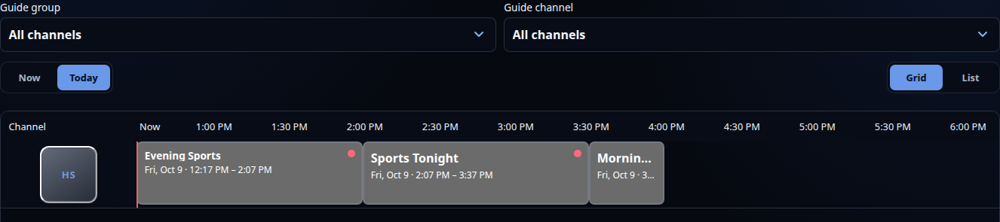

# TV Guide

Live TV offers **Browse / Search / Guide** when viewer-specific program search
and multi-day guide data are available. Watch Now uses Dispatcharr's listings;
it cannot supply missing schedules.

## Browse the schedule

Choose a group, channel or day, then use **Grid** or **List**. Both layouts are
available on desktop and phones and remember the selected layout locally.
Dates are offered only when listings exist in the filtered lineup, up to seven
days ahead. All times use your browser's local timezone.

Grid shows the selected local day with sticky channel identities. Today retains
enough of an ongoing programme to make its title readable and excludes ended
shows. The Now marker shows the actual current time. Future days open at midnight.
Use the desktop horizontal scrollbar or swipe on a phone.

List has a half-hour slider for a three-hour window. **Now** returns to the
current time. Each layout retains its date/time while sharing channel filters.

Grid starts with up to fifty channels and loads ten more near the bottom.
**Next channels** starts a new batch at the five-hundred-channel or
ten-thousand-airing boundary. List keeps **Load more channels**. Loading errors
offer Retry; a failed guide fetch is not labelled an empty schedule.

**View in Guide** from Browse/Search opens Guide filtered to that channel.
Guide filters do not change Browse/Search selections.

## Watch or record

Selecting a programme opens details without autoplay. For a current airing:

- **Watch Live** plays the ordinary live stream when no recording is active.
- Managers can use **Watch & Record** to create a capture and watch near its
  latest footage with pause and rewind, or **Record** to schedule without watching.
- If a permitted capture is already active, **Watch** offers **Watch from Beginning**
  and **Watch Live**, both using that capture.

Watch from Beginning means the earliest available captured footage, not the
start of a broadcast that was missed before recording began. Watch Live through
a capture joins its safe recorded edge with a short delay. See
[recording and live pause](watch-while-recording.md) for controls and limits.

Future airings offer **Record** without a watching action. Confirmation identifies
the exact channel/start/end, and the server checks the airing against the guide.
Dispatcharr applies its configured recording padding. Recording actions require
DVR management access; viewers with view access can watch an existing capture.

In Grid, tap a channel logo to open its live options. List also has a direct
**Watch live** channel button. Channel watching tunes the current broadcast,
regardless of the displayed date.

## Recording markers

Grid and List show a **solid red dot** on matching scheduled or active airings.
The tooltip and accessible name distinguish **Scheduled recording** from
**Recording now**; the Guide dot does not pulse. Completed, cancelled, failed,
expired or inaccessible recordings are not marked.

The screenshot uses sample channels and recordings, not a real viewer's lineup.

The Guide reads the viewer-authorized DVR catalog when opened, after returning
from playback or a hidden browser tab, and every thirty seconds while visible.
Scheduling through Watch Now updates that catalog immediately. Recordings made
elsewhere can take a short time to appear. Markers require DVR connection and
current account/channel access.

Overlapping listings share one channel block; opening it shows the original
airing choices and their matching recording markers. This displays conflicting
provider listings without changing their times or recording actions.

## Playback and navigation

Guide watching opens a dedicated player. **Details** below the title opens
programme information without stopping video. **Stop** ends playback while
leaving the Guide player ready to restart. **Back to Guide** stops playback and
restores retained filters, date/time and scroll position. Neither action stops
a recording. Guide auto-refresh pauses while its dedicated player is open.

Browse/Search/Guide can retain an existing stream when changing discovery modes.
Search playback offers Back to search results and restores the retained query
and results position. Changing viewer sections or signing out ends browser
playback. Refresh restores navigation, not video or a playback position.

## Data and access limits

Every request intersects the viewer's current channel lineup. Guide depth depends
on Dispatcharr and the existing feed/index limits. A shorter range can be offered
for a large feed; seven days is a request limit, not guaranteed coverage.
Search remains limited to twenty-four hours.

Grid batches retain at most five hundred channels and ten thousand airings.
Upstream feeds remain bounded at thirty-two MiB decompressed, with a retained
eight-MiB index and fifty thousand programmes. Successful guide data is cached
for five minutes, and visible listings refresh when returning to Guide or after
the cache expires. Refresh waits while an airing dialog or slider interaction is
active. Changing data can limit exact scroll restoration.

DVR recordings are shared resources, restricted by DVR role and current lineup.
No future-airing playback, catch-up of uncaptured programmes, recurring recording
or transcoding is added. See [DVR setup](dvr.md) and
[release preparation](release-readiness-1.4.0.md) for permissions and validation.

The [expanded guide specification](expanded-tv-guide-spec.md) retains historical
proposals and implementation detail; it is not a list of promised features.
