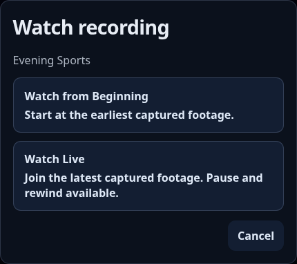
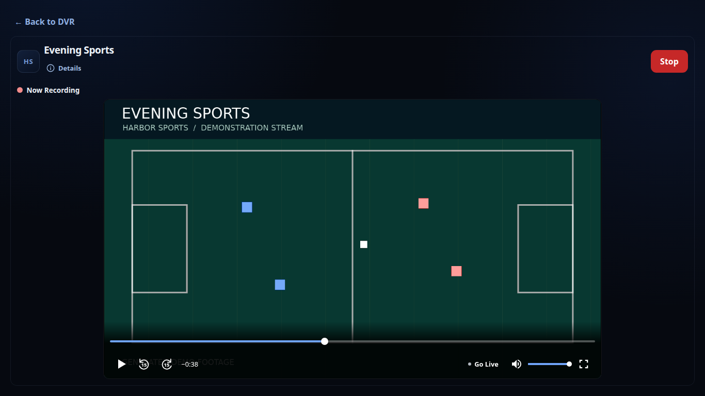
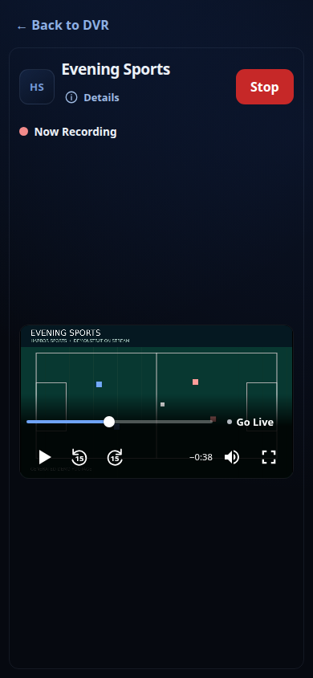

# Recording and live pause

Watch an active Dispatcharr recording from its beginning or join near its latest
captured footage, then pause and rewind while capture continues. Dispatcharr
0.32.0 is the validated active-recording baseline; Watch Now checks the supported
capabilities rather than using a version whitelist.

DVR must be connected, your account must have DVR view or manage access, and the
channel must be in your current viewer lineup. See [DVR setup](dvr.md).

## Start watching and recording

In Live TV Browse or current-show Search, open the Watch menu and choose
**Watch & Record**. In Guide, open the current airing's details and choose
**Watch & Record**. This requires management access and a current guide airing.

Watch Now creates one recording from now until that airing's scheduled end,
including Dispatcharr's configured padding, then opens near the latest captured
footage. It waits for usable video; a new capture needs time to publish its first
segments. An error saying the recording is still starting does not mean it was
cancelled: check **DVR → Recording** before trying again.

**Record** opens the confirmation for an exact current or future airing without
starting playback. A future airing offers Record, not watching. Starting late
captures only what remains; it cannot recover footage before recording began.

Recording continues if you stop playback, leave the channel, close Watch Now or
sign out. To finish capture early, use the separate **Stop recording** action.

## Watch an existing capture

An active capture shows **Now Recording** below **Watch** in Live TV and
**DVR → Recording**. Choose Watch, then:

- **Watch from Beginning** starts at the earliest available captured footage.
- **Watch Live** joins near the latest safe recorded point with pause and rewind.

Both use the existing recording; neither creates another one. Another permitted
viewer can use the same capture after signing in. Live sits behind the recorded
edge to avoid requesting incomplete segments: normally about twelve seconds with
stock four-second segments, plus any source/network delay.

On a channel without an active recording, **Watch Live** starts the ordinary live
stream directly. It does not create a persistent recording or promise a retained
rewind buffer. Choose Watch & Record when you want captured footage to pause or
revisit.

## Player controls

The inline recording player has one control bar with:

- Play/pause and a timeline covering available captured footage.
- Back/forward fifteen seconds, clamped to the available range.
- **Go Live** to resume near the safe recorded edge; **LIVE** indicates that position.
- Volume and fullscreen controls.

The timeline grows as video arrives. It does not treat the scheduled end time as
playable duration. Seeking and skipping preserve pause; Resume continues from
the paused point rather than automatically jumping live. Go Live deliberately
resumes playback.

Controls fade during playback and remain available while paused, focused or
scrubbing. A spinner appears when media is preparing or buffering. **Details**
below the player title opens metadata without stopping video. **Stop** or the
Back action ends your playback only.

These screenshots use synthetic channels and media, not a household's lineup.
The phone image demonstrates layout; it is not a native iPhone playback test.
Apple's native fullscreen controls can differ from the inline controls. Return
to the inline player for Watch Now's captured timeline and Go Live actions.

## Recording indicators and management

The **Now Recording** indicator in channel controls and the recording player's
status can pulse; reduced-motion preferences keep it static. The indicator
retires when capture ends.

Guide Grid and List use a **solid red dot** for a scheduled or active recording.
Its tooltip and accessible label distinguish **Scheduled recording** from
**Recording now**. The guide dot does not pulse. It marks permitted matching
airings, including choices within overlapping listings; finished, cancelled and
inaccessible recordings are not marked. Guide refreshes its recording state
while visible, so changes made elsewhere can take a short time to appear.

In **DVR → Recording**, managers use the Watch dropdown for **Extend 30 minutes**
and **Stop recording**, each with confirmation. Stopping capture keeps the
recorded portion for processing. View-only viewers can watch but cannot change
capture. Scheduled jobs have **Cancel recording**. Finished or attention items
have a manager-only trash icon beside the title, with deletion confirmation.

Recordings are shared Dispatcharr resources. Cancelling, stopping or deleting
one affects everyone who can access it. Playback controls never cancel capture.

## When recording finishes

Watch Now keeps the player open while Dispatcharr prepares the finished file.
It switches to that file when ready, preserving the current position and paused
state. A brief wait can occur during processing.

A long pause across completion can outlast Dispatcharr's temporary HLS segments;
Watch Now checks the authorized recording again and recovers through the finished
file. Browser support for its container and codecs still applies. If it cannot
play, a clear error lets you return to finished DVR and use VLC or download.

Download and recording sharing are available for playable **finished**
recordings. VLC is also available for active recordings
in **DVR → Recording → Watch options → Watch in VLC**, with beginning/live
choices; see
[active recording VLC](active-recording-vlc.md). A Live TV share link selects the channel, not a captured timestamp;
Live TV VLC offers the same beginning/live choices when an active recording is
available; otherwise it uses the ordinary live stream.

## Devices and limits

Apple WebKit uses native HLS for active recordings. Other supported Media Source
browsers use bundled hls.js. Neither route transcodes media, and active HLS
support does not guarantee that the same browser can play every finished MKV.

On iPhone/iPad, add Watch Now using Safari **Share → Add to Home Screen**.
Remove and re-add an older shortcut to refresh its cached icon. Picture-in-picture
in the home-screen app is deferred, and the shortcut does not add offline media.

There is no saved playback position after refresh, sign-out, expiry or restart.
Playback ends on logout, DVR disconnection, another playback or access revocation.
An active playback generation has a six-hour maximum and also ends at session
expiry. Captured footage availability remains subject to Dispatcharr and
browser/device support; unlimited pause or retention is not promised.

No catch-up for uncaptured broadcasts, recurring recording rules, commercial
skipping, recording-directory mount, database or transcoder is added. Watch Now
remains one non-root container; Dispatcharr stores and processes the recording.
